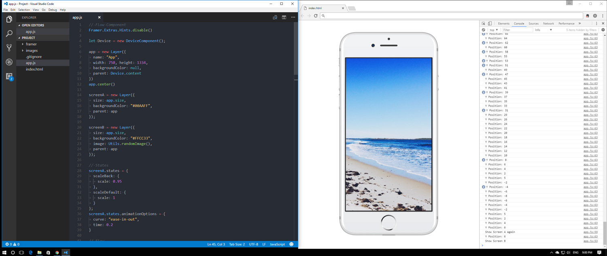

# Framer JS notebook

My self learning notes on using Framer with plain JS instead of CoffeeScript.

Context:
- **Framer** is the MacOS-exclusive software that you've surely heard about.
- The **Framer Library** is the engine running behind the scenes. It's an open source project and that's what these notes are about.

2020 clarification update:
- The "Framer" this repo refers to has long been abandoned by its creators in favor of Framer X, the next evolution of the tool based on React.
- This repo now contains the old "Framer Classic" library for preservation purposes, in case it's deleted from the official source.


## Who is this for?
- Anyone who feels comfortable with Framer and curious to try it with plain JS flavor.
- Anyone wanting to try Framer on Windows. However, if you want to use CoffeeScript, then check [this guide](http://www.prototypingwithframer.com/framer-on-windows-with-atom/).
- Anyone who enjoys tinkering with prototyping tools.

## Set up the Framer Library

## [Download](https://builds.framerjs.com/latest/Framer.zip)
^ Stable build, directly from the official 'builds' subdomain.

1. Unzip the file and you'll get this folder:
```
Project/
  framer/
  images/
  app.js
  index.html
```
2. Open **index.html** in a WebKit browser.

3. **app.js** is your playground. Enjoy!

Tip: Set your workspace just like Framer.



# Index - Notes and snippets

- **[Console Log](#console-log)**
- **[Set Device](#set-device)**
- **[Set Custom Device](#set-custom-device)**
- **[Scroll Component](#scroll-component)**
- **[Page Component](#page-component)**
- **[Flow Component](#flow-component)**
- **[Gotchas](#gotchas)**


## Console Log

> Framer (CoffeeScript)
```javascript
print "Check, please"
```
> Framer Library (JS)
```javascript
console.log("Check, please");
```

## Set Device

```javascript
let Device = new DeviceComponent();
Device.setupContext();
Device.deviceType = "apple-iphone-7-gold";
```

## Set Custom Device

```javascript
let Device = new DeviceComponent();
Device.setupContext();
// Tablet
Device.customize({
	screenWidth: 720,
	screenHeight: 1024,
	deviceImage: "http://f.cl.ly/items/001L0v3c1f120t0p2z24/custom.png",
	deviceImageWidth: 800,
	deviceImageHeight: 1214
});
```

## Scroll Component
```javascript
// Scroll Component Example
let Device = new DeviceComponent();
Device.setupContext();

let myScroll = new ScrollComponent({
	width: 750, height: 1334,
	scrollHorizontal: false
});

let placeholderContent = new Layer({
	width: 750, height: 2500,
	backgroundColor: "skyblue",
	parent: myScroll.content
});

myScroll.on(Events.Move, function(){
	console.log("Scroll: " + myScroll.scrollY)
});
```
[Back to top](#notes-and-snippets)

## Page Component
```javascript
// Page Component Example
let Device = new DeviceComponent();
Device.setupContext();

let pageCount = 8;
let gutter = 20;

let myPageComponent = new PageComponent({
	width: 750, height: 1334,
	scrollVertical: false,
	clip: false
})

for (let i = 0; i < pageCount; i++) {
	let page = new Layer({
		name: "Page " + i,
		size: myPageComponent.size,
		x: (myPageComponent.width + gutter) * i,
		backgroundColor: "#00AAFF",
		hueRotate: i * 20,
		parent: myPageComponent.content
	});
	page.onClick(function() {
		console.log("Clicked: " + this.name);
		myPageComponent.snapToPage(this);
	});
}
```
[Back to top](#notes-and-snippets)

## Flow Component
```javascript
// Flow Component Example
Framer.Extras.Hints.disable()

let Device = new DeviceComponent();
Device.setupContext();

let screenA = new Layer({
	size: Screen.size,
	backgroundColor: "#00AAFF"
});

let screenB = new Layer({
	size: Screen.size,
	backgroundColor: "#FFCC33",
	image: Utils.randomImage()
});

// States
screenA.states = {
	scaleBack: {
		scale: 0.95
	},
	scaleDefault: {
		scale: 1
	}
};
screenA.states.animationOptions = {
	curve: "ease-in-out",
	time: 0.2
}

// Flow
let flow = new FlowComponent({
	size: Screen.size
})

flow.showNext(screenA);

// Events
screenA.onClick(function() {
	screenA.animate("scaleBack");
	flow.showOverlayBottom(screenB);
	console.log("Show Screen B");
});

screenB.onClick(function() {
	screenA.animate("scaleDefault");
	flow.showPrevious();
	console.log("Show Screen A again");
});
```
[Back to top](#notes-and-snippets)

## Gotchas

> Getting a layer's background color
```javascript
// In the old times, this line would return the value you expect
print(layerA.backgroundColor)

// This is how you'd access the color value now
console.log(layerA.backgroundColor.color)
```
[Back to top](#notes-and-snippets)

---

I'll continue updating these notes.

I'm using the good old ES5 for now, but that's one of the goals of this experiment: **to try to replicate prototypes on ES5 and ES6. This is just for fun & learning.**

[@72mena](https://twitter.com/72mena)